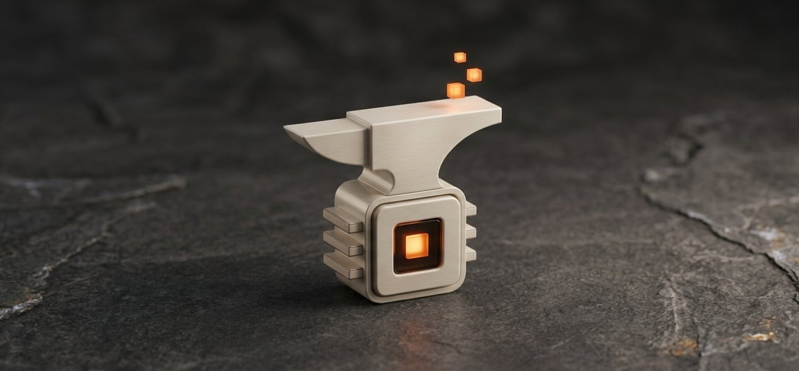
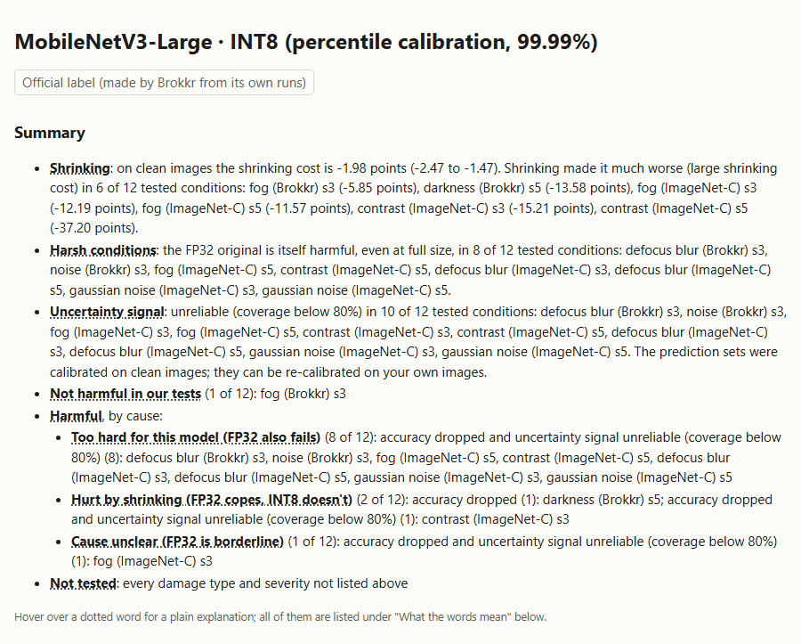

<p align="center">
  
</p>

# Brokkr

**Shrink AI models for small hardware, and find out honestly what you lost.**

## Status

*3 October 2026.* Brokkr is a research project becoming a tool. Everything below was measured on one
Windows laptop (Intel Core i5-1235U, CPU only), on ImageNet test images with simulated damage.

**Works today**

- Shrinking an image classifier from full precision (FP32) to small whole numbers (INT8) with ONNX
  Runtime, using the INT8 recipe chosen in our study.
- Testing both builds on clean images and under simulated darkness, fog, blur, noise and low contrast,
  with 95% intervals, and checking the model's "I'm not sure" signal (prediction sets and their size).
- Laptop latency for every usable build: typical and slow times, and how much they varied between
  repeat runs.
- A label for every model in the study, each number checked against the result file it came from; one
  released label in [`published/labels/`](published/labels/).

**Not built yet**

- A package on PyPI and a quick start for your own model (roadmap steps 3 and 4).
- The catalog website (step 2) and a hosted upload page (step 5).
- Object detection: Brokkr tests image classifiers only.
- Any device other than this laptop: nothing has been measured on a Raspberry Pi or another board
  (step 6).
- Signals such as EEG or EMG (step 7).

## What it does

Brokkr takes a model, shrinks it, and tests the full-size and shrunk builds side by side on the same
images: clean, and under each kind of simulated damage. It then writes a **label**: how big each build
is, how accurate it is, how much shrinking cost, whether its "I'm not sure" signal still works, and how
fast it runs on named hardware. Each condition is judged separately, and the label says whether the
full-size model already failed there.

## Example label

<picture>
  <source media="(prefers-color-scheme: dark)" srcset="docs/assets/label-summary-dark.png">
  
</picture>

The top of the released label for MobileNetV3-Large, INT8:
[`label.html`](published/labels/mobilenet_v3_large/label.html) (GitHub shows it as source; open the
downloaded file in a browser) and [`label.json`](published/labels/mobilenet_v3_large/label.json), the
only source the page is made from. The format is defined in [docs/label_schema.md](docs/label_schema.md).

<details>
<summary>The same label summary as text</summary>

<!-- label-example:start (written by scripts/41_readme_label_example.py; do not edit by hand) -->
This is the top of the label for **MobileNetV3-Large · INT8 (percentile calibration, 99.99%)**, measured on 10000 ImageNet-1k validation images (the test split):

|  | FP32 (full precision) | INT8 (percentile calibration, 99.99%) |
|---|---|---|
| File size | 22.22 MB | 5.92 MB |
| Top-1 accuracy, clean images | 75.58% (74.70% to 76.48%) | 73.60% (72.75% to 74.52%) |
| Coverage of its prediction sets, clean images | 90.58% (90.01% to 91.16%), set size 2.28 | 90.22% (89.62% to 90.85%), set size 2.63 |

Shrinking cost on clean images: -1.98 (-2.47 to -1.47) points (INT8 minus FP32 on the same images, so negative means shrinking lost accuracy).

For the 12 kinds of damage tested, the label opens with three lines:

- **Shrinking** made it much worse (a large shrinking cost) in 6 of 12 conditions; the largest is contrast (ImageNet-C) s5, -37.20 points.
- **Harsh conditions:** the FP32 original is itself harmful, even at full size, in 8 of 12.
- **Uncertainty signal:** unreliable (coverage below 80%) in 10 of 12. The prediction sets were calibrated on clean images and can be re-calibrated on your own images.

Then it sorts each condition by what happened to the shrunk model, and why:

- **Not harmful in our tests** (1 of 12): fog (Brokkr) s3
- **Harmful, too hard for this model (FP32 also fails)** (8 of 12)
- **Harmful, hurt by shrinking (FP32 copes, INT8 doesn't)** (2 of 12): darkness (Brokkr) s5, contrast (ImageNet-C) s3
- **Harmful, cause unclear (FP32 is borderline)** (1 of 12): fog (ImageNet-C) s3

"Harmful" means a whole 95% interval is below a line whose value was written down before these results existed and adopted for the labels afterwards, unchanged: coverage below 80%, or a damage drop (accuracy under the damage minus clean accuracy) below -10 points. "Not harmful in our tests" is not a guarantee.

A recipe that breaks a model is labelled as such: MobileNetV3-Small's INT8 build matched FP32's first answer on only 2.73% of 256 tuning images (a usable build needs at least 20%), so its label opens with "do not use this INT8 build".
<!-- label-example:end -->

</details>

## What we found

In our tests, on one laptop, with simulated damage:

**One model in depth (Stages 1–3, MobileNetV3-Large).** How the default INT8 recipe broke it, which
fixes worked, and how its "I'm not sure" signal failed quietly under damage:
[Brokkr Technical Report 1](docs/writeup.md); predictions and outcomes in
[docs/hypotheses_stage3.md](docs/hypotheses_stage3.md).

**Stage 4: the breadth study.** Plain-language summary: [docs/stage4_story.md](docs/stage4_story.md);
predictions and outcomes: [docs/hypotheses_stage4.md](docs/hypotheses_stage4.md).

<!-- findings:start (written by scripts/45_readme_findings.py; do not edit by hand) -->
- 10 torchvision models, 13 test conditions (clean and 12 damaged). All 10 full-precision models passed
  the sanity check against their published accuracy. 9 INT8 builds were usable; the one for
  MobileNetV3-Small broke.
- Consistent with prior work on quantized models (Xiao et al., 2023, arXiv:2304.03968; Yaghoubi Araghi
  et al., 2026, 4-bit, arXiv:2607.18540), we found that shrunk models can pass a normal accuracy check
  and still collapse in dark or low-contrast images, and in our small pre-registered test, clean
  accuracy didn't predict which. In wider exploratory checks, which models were hit varied with the
  condition, and fog hit some models too.
- Pre-registered (Stage 4, 9 models, 10,000 test images; verdicts unchanged): the two predictions about
  collapse were judged at two conditions only, darkness (Brokkr) s5 (H21) and contrast (ImageNet-C) s3
  (H20). In each, 2 of 9 models lost much more to shrinking under the damage than on clean images
  (MobileNetV3-Large and EfficientNet-B0); we had predicted at least 5, so both are FAIL. Clean accuracy
  and how much shrinking cost under damage showed no strong relation (H18b: PASS, 8 of 11 judged
  conditions, 8 needed; a weak test with 9 models).
- For example, MobileNetV3-Large's shrunk build scores 73.60% on clean images, 2.0 points below its
  full-precision build, but 13.6 points below it under darkness (Brokkr) s5.
- Exploratory, not pre-registered: across all 12 damaged conditions on the labels, 6 of the 9 usable
  shrunk builds have at least one condition with a large shrinking cost (the whole interval more than
  5.0 points below the full-precision build). Besides MobileNetV3-Large and EfficientNet-B0, this
  includes ConvNeXt-Tiny, MobileNetV2, RegNetY-400MF and ResNet-50. The condition hitting the most
  models is contrast (ImageNet-C) s5 (6 models).
- Exploratory, not pre-registered: large shrinking costs appeared in 19 of 51 usable build-condition
  pairs under darkness, fog and low contrast, against 3 of 43 under noise and blur (worst extra gap 38.9
  vs 8.8 points; near-floor cells excluded). The median build's extra loss was under 5.0 points in every
  condition except contrast (ImageNet-C) s5 (14.0 points). Our conditions did not include impulse noise,
  which Xiao et al. found hit quantized models most.
- The tests of *why* it happens have not found the cause: each was inconclusive or rejected our guess.
  The question is parked while the labels and the website ship.
<!-- findings:end -->

## Why Brokkr?

What it adds to shrinking a model:

- **Testing under damage**, not only on clean images: darkness, fog, blur, noise and low contrast, at
  more than one strength, each reported on its own.
- **Separating two kinds of weakness:** what shrinking cost (the shrunk build against the full-size one,
  on the same images) apart from weakness the full-size model already had.
- **An uncertainty check:** whether the model's "I'm not sure" signal (its prediction sets) still covers
  the right answer under damage, always shown with how big the sets are.
- **A shareable label:** `label.json`, an HTML page and a Hugging Face model card, where every number
  names the result file it came from and is checked against it.
- **One command:** `brokkr-edge test` runs the whole set of conditions on a model (today, for the models
  in the study; for your own model from step 3).

Brokkr builds on other tools rather than replacing them: it uses ONNX Runtime's quantization tools to
make the INT8 build, and ONNX Runtime to run every build.

## When you don't need Brokkr

- **Your model only runs in controlled conditions** (fixed lighting, a fixed camera) that match the
  images you already tested it on.
- **You already test the shrunk model on real data from the place it will run.** That tells you more
  than simulated damage can.

## Quick start

These commands set up the code and run its automatic checks; they need no dataset:

```bash
git clone https://github.com/Vasco1290/Brokkr.git
cd Brokkr
python -m venv .venv
.venv\Scripts\activate        # Windows (on Linux/macOS: source .venv/bin/activate)
python -m pip install --upgrade pip
pip install torch torchvision --index-url https://download.pytorch.org/whl/cpu
pip install -e ".[dev]"
pytest
```

Upgrade pip first: the pip that comes with Python 3.10 fails on the torch step (it tries to build a
dependency from source and cannot find the build tool on the PyTorch package index).

To see a label, open `published/labels/mobilenet_v3_large/label.html` in a browser. Testing a model
needs the ImageNet validation images (see [Reproduce](#reproduce)); testing your own model and images
comes in roadmap step 3.

## How it works

1. **Shrink.** Export the model to ONNX at full precision (FP32), then build INT8 with ONNX Runtime
   (percentile calibration, the recipe chosen in Stage 3 on separate tuning images).
2. **Damage.** Make each test image again under each condition: Brokkr's own darkness, fog, blur and
   noise, and ImageNet-C's fog, contrast, blur and noise, each named with its source.
3. **Measure.** Run both builds on the same images: accuracy, the prediction sets' coverage and size,
   calibration and confidence ranking, with paired 95% intervals; and laptop latency.
4. **Judge.** For each build and condition, decide "not harmful in our tests", "harmful" or
   "borderline" by two lines fixed in advance (coverage, and the fall in accuracy from clean images).
5. **Label.** Write `label.json` from the checked result files only, then render the HTML page and the
   model card from it.

**The honesty rules**

- **No made-up numbers.** Every number comes from running the code, is saved as JSON first, and names
  the machine, library versions and git commit it came from. Labels, pages and this README's results
  are generated from that JSON.
- **Predictions first.** Hypotheses and pass rules are committed before measuring; outcomes are
  appended, never edited. Later analyses are marked "exploratory".
- **No tuning on the test images.** Settings are chosen on separate tuning and calibration images.
- **Intervals everywhere.** Accuracy and coverage carry 95% bootstrap intervals; differences are paired
  on the same images. Coverage is never shown without its average set size.
- **Named hardware.** Laptop latency is called laptop latency, never the speed of an edge device.
- **Unknown means "not recorded"**, never a guess. **No claim of being first**; prior work is cited.

The full rules are in [CLAUDE.md](CLAUDE.md).

## Reproduce

**Test data.** Accuracy is measured on the ImageNet-1k validation set. Its terms allow
non-commercial research and educational use only, and each user must accept them:

1. Log in at huggingface.co and accept the terms at https://huggingface.co/datasets/ILSVRC/imagenet-1k
2. Create a "Read" access token, then run `hf auth login` in a regular terminal and paste it
3. Download the validation files into `data/` (not in git):

```bash
pip install -e ".[data]"
hf download ILSVRC/imagenet-1k --repo-type dataset --include "data/validation-*" --local-dir data/imagenet-1k
```

The ImageNet-C conditions need `pip install -e ".[imagenet-c]"` and
`pip install --no-deps imagecorruptions==1.1.2`. To recreate the exact package versions, see
`requirements-lock.txt`.

**Stage 1** (export, FP16 and INT8 builds, speed, size, accuracy, results page):

```bash
python scripts/run_stage1.py
```

**Stages 2–3:** section 9 of the [technical report](docs/writeup.md). **Stage 4:** the scripts are
numbered in the order the work was done ([STATUS.md](STATUS.md), section 3, lists what each makes).

**Labels and this README's generated parts** (need the result files in `results/`, which are not in
git):

```bash
python scripts/39_make_labels.py
python scripts/40_check_labels.py
python scripts/41_readme_label_example.py
python scripts/45_readme_findings.py
python scripts/46_readme_screenshots.py
python scripts/22_check_results.py
```

`scripts/40` prints PASS only if every number in every label equals its source and both generated
README blocks equal a fresh render. Laptop latency (`scripts/44_laptop_latency.py`) is a long run,
started by hand with the laptop plugged in and other programs closed.

## Licences and data terms

- **Code:** Apache-2.0 ([LICENSE](LICENSE)).
- **Labels:** CC BY 4.0. Each label's own numbers and text are Brokkr output.
- **Model weights keep their original licences**, recorded on every label. The torchvision weights used
  here were trained on ImageNet-1k and carry ImageNet's non-commercial terms of access.
- **ImageNet:** non-commercial research and educational use only; no ImageNet image is in this
  repository or on any label.
- **ImageNet-C conditions** are generated with the `imagecorruptions` package (Apache-2.0; Michaelis et
  al., 2019, arXiv:1907.07484), an extension of the ImageNet-C code of Hendrycks & Dietterich, 2019
  (arXiv:1903.12261), with a one-line fix so that fog runs on NumPy 2. They are not directly comparable
  to the released ImageNet-C files.

## Roadmap

Next: the catalog website and making this repository public, then testing your own model. The full
plan, in order and with dates: [ROADMAP.md](ROADMAP.md).
